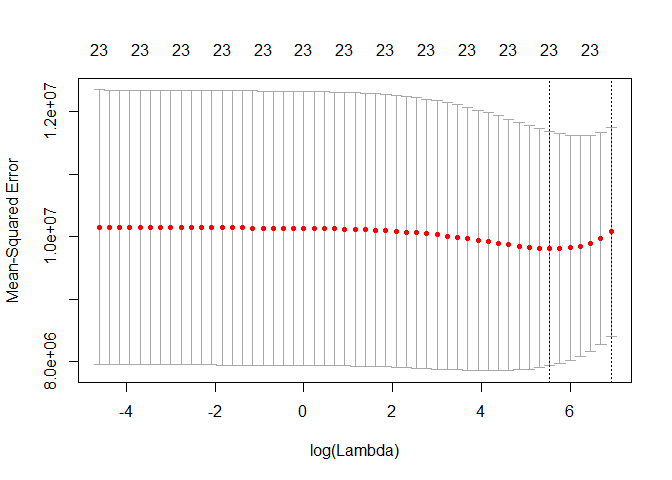

Car\_Blog
================
Derek Shambo
December 10, 2018

Here we will be taking a look at vehicle data, specifically 1985 import car and truck specifications. This data set has a lot of information, and plenty of variables to play around with. We will try to predict what the price of a vehicle would be using ridge regression.

``` r
car_data <- read.csv("https://archive.ics.uci.edu/ml/machine-learning-databases/autos/imports-85.data",
                     col.names = c("symboling",
                                   "normalized-losses",
                                   "make",
                                   "fuel-type",
                                   "aspiration",
                                   "num-of-doors",
                                   "body-style",
                                   "drive-wheels",
                                   "engine-location",
                                   "wheel-base",
                                   "length",
                                   "width",
                                   "height",
                                   "curb-weight",
                                   "engine-type",
                                   "num-of-cyliners",
                                   "engine-size",
                                   "fuel-system",
                                   "bore",
                                   "stroke",
                                   "compression-ratio",
                                   "horsepower",
                                   "peak-rpm",
                                   "city-mpg",
                                   "highway-mpg",
                                   "price"))
```

This data has a lot of variables, and will be a prime candidate for some ridge lasso regression. This will help us in dimension regression and really determine the most important varaibles when determining the price of a vehicle. Ridge regression differ from OLS regression by penalizing the estimates. Features that are less influential will be penalized, and more influential features will be penalized less. This helps to be sure that the most important features play a bigger role in our predictions and that our model isn't be overfitted to our dataset.

First, we will do a little bit of data exploration and preparation

``` r
#lets see some summary statistics on our data set
summary(car_data)
```

    ##    symboling       normalized.losses         make     fuel.type  
    ##  Min.   :-2.0000   ?      : 40       toyota    :32   diesel: 20  
    ##  1st Qu.: 0.0000   161    : 11       nissan    :18   gas   :184  
    ##  Median : 1.0000   91     :  8       mazda     :17               
    ##  Mean   : 0.8235   150    :  7       honda     :13               
    ##  3rd Qu.: 2.0000   104    :  6       mitsubishi:13               
    ##  Max.   : 3.0000   128    :  6       subaru    :12               
    ##                    (Other):126       (Other)   :99               
    ##  aspiration  num.of.doors       body.style drive.wheels engine.location
    ##  std  :167   ?   :  2     convertible: 5   4wd:  9      front:201      
    ##  turbo: 37   four:114     hardtop    : 8   fwd:120      rear :  3      
    ##              two : 88     hatchback  :70   rwd: 75                     
    ##                           sedan      :96                               
    ##                           wagon      :25                               
    ##                                                                        
    ##                                                                        
    ##    wheel.base         length          width           height     
    ##  Min.   : 86.60   Min.   :141.1   Min.   :60.30   Min.   :47.80  
    ##  1st Qu.: 94.50   1st Qu.:166.3   1st Qu.:64.08   1st Qu.:52.00  
    ##  Median : 97.00   Median :173.2   Median :65.50   Median :54.10  
    ##  Mean   : 98.81   Mean   :174.1   Mean   :65.92   Mean   :53.75  
    ##  3rd Qu.:102.40   3rd Qu.:183.2   3rd Qu.:66.90   3rd Qu.:55.50  
    ##  Max.   :120.90   Max.   :208.1   Max.   :72.30   Max.   :59.80  
    ##                                                                  
    ##   curb.weight   engine.type num.of.cyliners  engine.size     fuel.system
    ##  Min.   :1488   dohc : 11   eight :  5      Min.   : 61.0   mpfi   :93  
    ##  1st Qu.:2145   dohcv:  1   five  : 11      1st Qu.: 97.0   2bbl   :66  
    ##  Median :2414   l    : 12   four  :158      Median :119.5   idi    :20  
    ##  Mean   :2556   ohc  :148   six   : 24      Mean   :126.9   1bbl   :11  
    ##  3rd Qu.:2939   ohcf : 15   three :  1      3rd Qu.:142.0   spdi   : 9  
    ##  Max.   :4066   ohcv : 13   twelve:  1      Max.   :326.0   4bbl   : 3  
    ##                 rotor:  4   two   :  4                      (Other): 2  
    ##       bore         stroke    compression.ratio   horsepower     peak.rpm 
    ##  3.62   : 23   3.40   : 20   Min.   : 7.000    68     : 19   5500   :37  
    ##  3.19   : 20   3.03   : 14   1st Qu.: 8.575    70     : 11   4800   :36  
    ##  3.15   : 15   3.15   : 14   Median : 9.000    69     : 10   5000   :26  
    ##  2.97   : 12   3.23   : 14   Mean   :10.148    116    :  9   5200   :23  
    ##  3.03   : 12   3.39   : 13   3rd Qu.: 9.400    110    :  8   5400   :13  
    ##  3.46   :  9   2.64   : 11   Max.   :23.000    95     :  7   6000   : 9  
    ##  (Other):113   (Other):118                     (Other):140   (Other):60  
    ##     city.mpg      highway.mpg        price    
    ##  Min.   :13.00   Min.   :16.00   ?      :  4  
    ##  1st Qu.:19.00   1st Qu.:25.00   13499  :  2  
    ##  Median :24.00   Median :30.00   16500  :  2  
    ##  Mean   :25.24   Mean   :30.77   18150  :  2  
    ##  3rd Qu.:30.00   3rd Qu.:34.50   5572   :  2  
    ##  Max.   :49.00   Max.   :54.00   6229   :  2  
    ##                                  (Other):190

``` r
#one thing that jumps out is that several variables that should be numeric are factors with "?" being one of the values listed. These need to be corrected, and the variables need to be changed to numeric.
car_data$price[car_data$price == "?"] <- NA
car_data$price <- as.numeric(as.character(car_data$price))

car_data$bore[car_data$bore == "?"] <- NA
car_data$bore <- as.numeric(as.character(car_data$bore))

car_data$stroke[car_data$stroke == "?"] <- NA
car_data$stroke <- as.numeric(as.character(car_data$stroke))

car_data$horsepower[car_data$horsepower == "?"] <- NA
car_data$horsepower <- as.numeric(as.character(car_data$horsepower))

car_data$peak.rpm[car_data$peak.rpm == "?"] <- NA
car_data$peak.rpm <- as.numeric(as.character(car_data$peak.rpm))

car_data$normalized.losses[car_data$normalized.losses == "?"] <- NA
car_data$normalized.losses <- as.numeric(as.character(car_data$normalized.losses))

car_data$num.of.doors[car_data$num.of.doors == "?"] <- NA

#now that all of the ?s have been corrected, lets check to see how many NAs there actually are
sum(is.na(car_data)) #there are a total of 58 NAs.
```

    ## [1] 58

``` r
sum(is.na(car_data$normalized.losses)) # however, 40 of them appear in the normalized losses column. Because so many of the values for this variable are missing, we will remove it.
```

    ## [1] 40

``` r
car_data$normalized.losses <- NULL

#for our analysis here, we will also eliminate the make variable. it is well know that certain makes of cars cost significantly more others. we will look to see what our other variables can tell us regarding price
car_data$make <- NULL

sum(complete.cases(car_data))#here we see that 12 of the vehicles left are missing data. For the purposes of this analysis, we are going to only utilize complete cases. In the future, we could look into using imputation to correct the NAs.
```

    ## [1] 192

``` r
car_data <- car_data[complete.cases(car_data),]
```

Now we will start our ridge regression analysis

``` r
#first, we will seperate our data into our y and x values
y <- car_data$price
x <- car_data[,-24] %>% data.matrix()
#now we will create a sequence of lambda values for use in our analysis
lambdas <- 10^seq(3, -2, by = -.1)

#here we are creating models using all of our values of lambda
fit <- glmnet(x, y, alpha = 0, lambda = lambdas)
summary(fit)
```

    ##           Length Class     Mode   
    ## a0          51   -none-    numeric
    ## beta      1173   dgCMatrix S4     
    ## df          51   -none-    numeric
    ## dim          2   -none-    numeric
    ## lambda      51   -none-    numeric
    ## dev.ratio   51   -none-    numeric
    ## nulldev      1   -none-    numeric
    ## npasses      1   -none-    numeric
    ## jerr         1   -none-    numeric
    ## offset       1   -none-    logical
    ## call         5   -none-    call   
    ## nobs         1   -none-    numeric

``` r
#ridge regression involves hypertuning the lambda variable, and the cv.glmnet will help us determine the optimal value for it. it does this utilizing cross validation, hence the cv
cv_fit <- cv.glmnet(x, y, alpha = 0, lambda = lambdas)

#lets plot our cv_fit
plot(cv_fit)
```



``` r
#the lowest point on our curve represents the optimal value. we will grab that value now
opt_lambda <- cv_fit$lambda.min
opt_lambda
```

    ## [1] 251.1886

``` r
#using the predict function, we will select the model created using the optimal labda value
y_predicted <- predict(fit, s = opt_lambda, newx = x)

# Sum of Squares Total and Error
sst <- sum((y - mean(y))^2)
sse <- sum((y_predicted - y)^2)

# R squared
rsq <- 1 - sse / sst
rsq
```

    ## [1] 0.8879033

``` r
#our ridge regression identifies 88.6% of the variance in our training data

#finally, lets take a look at the coefficients used in our model
coef(fit)[,fit$lambda==opt_lambda]
```

    ##       (Intercept)         symboling         fuel.type        aspiration 
    ##     -49176.513232        -82.717253      -1507.080902        286.086464 
    ##      num.of.doors        body.style      drive.wheels   engine.location 
    ##       -444.125089       -568.537792        948.982194      11128.336018 
    ##        wheel.base            length             width            height 
    ##         68.043681        -12.252293        472.141507        194.807812 
    ##       curb.weight       engine.type   num.of.cyliners       engine.size 
    ##          2.570226       -160.121822      -1296.887802         98.981863 
    ##       fuel.system              bore            stroke compression.ratio 
    ##        -55.922154      -2696.380322      -2449.119538        -14.176825 
    ##        horsepower          peak.rpm          city.mpg       highway.mpg 
    ##         40.112218          1.102965        -46.537383         82.380479

Some of the key indicators of how much a vehicle will cost are the fuel type, engine location, number of cylinders, the bore, and the stroke. Our model does a pretty good job of explaining the variation we see in price, even without looking at the make of the vehicle.
