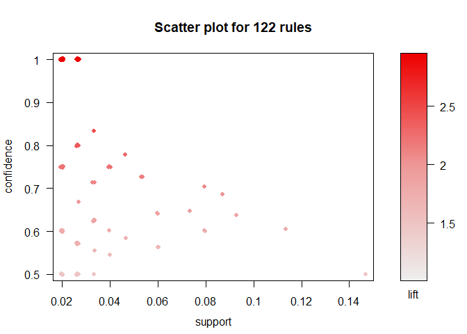
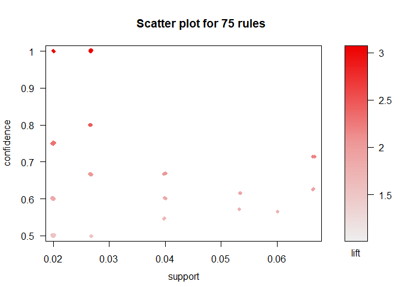
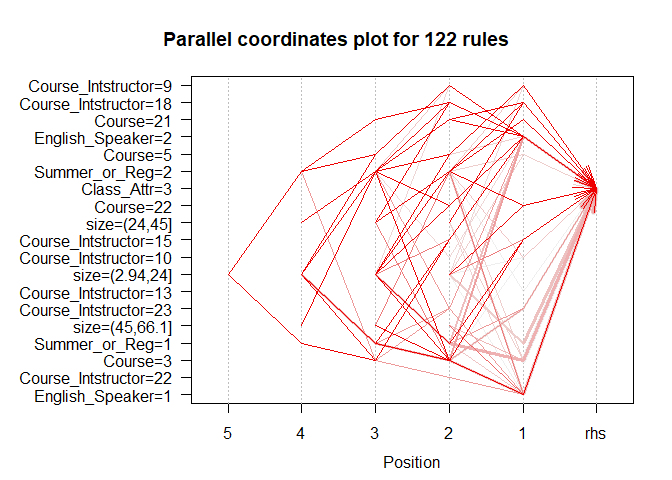
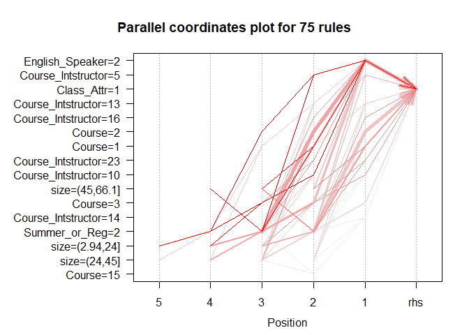

TA Blog
================
Derek Shambo
December 1, 2018

This post will be an analysis of TA scores and what is associated with good and poor performing TAs. The analysis conducted will be the creation of association rules. These rules will help us to understand how the variables given to us interact with each other.

First we will do our data input, exploration, and prep

``` r
ta_data <- read.csv("https://archive.ics.uci.edu/ml/machine-learning-databases/tae/tae.data",
         col.names = c("English_Speaker",
                       "Course_Intstructor",
                       "Course",
                       "Summer_or_Reg",
                       "Class_Size",
                       "Class_Attr"))

#variable explanation:
#English_speaker: whether or not the ta was an english speaker, english =1, non_english = 2
#Course_Instructor: who taught the course
#Course: type of course
#Summer_or_Reg: summer class or normal semester class. 1=summer, 2 = reg
#Class_Size: number of student in course
#Class_Attr: score given to TA, either low, medium or high

#lets check to see if there are any NAs present
sum(is.na(ta_data))
```

    ## [1] 0

``` r
#no NAs!

#lets look at the class size variable
summary(ta_data$Class_Size)
```

    ##    Min. 1st Qu.  Median    Mean 3rd Qu.    Max. 
    ##    3.00   19.00   27.00   27.93   37.00   66.00

``` r
#the mean and median are both at about 27 students, with the max being 66 and the min being 3

#to perform association rule mining, the variables used must be either factor or logical. I think it makes sense to divide class size into a small, medium, and large group. we will do this using the cut function
ta_data$size <- cut(ta_data$Class_Size, 3)

#convert all variables to factors
ta_data.new <- ta_data[,c(1:4,6:7)]

for(i in 1:ncol(ta_data.new)){
     ta_data.new[,i] <- as.factor(ta_data.new[,i])
}

#a look at the first 5 rows
head(ta_data.new)
```

    ##   English_Speaker Course_Intstructor Course Summer_or_Reg Class_Attr
    ## 1               2                 15      3             1          3
    ## 2               1                 23      3             2          3
    ## 3               1                  5      2             2          3
    ## 4               2                  7     11             2          3
    ## 5               2                 23      3             1          3
    ## 6               2                  9      5             2          3
    ##        size
    ## 1 (2.94,24]
    ## 2 (45,66.1]
    ## 3   (24,45]
    ## 4 (45,66.1]
    ## 5 (2.94,24]
    ## 6 (2.94,24]

Lets dive straight into association rule mining!

``` r
#lets first see what rules are created using the default settings
basket_rules.all <- apriori(ta_data.new)#looks like we found 41 rules under the default settings. 
```

    ## Apriori
    ## 
    ## Parameter specification:
    ##  confidence minval smax arem  aval originalSupport maxtime support minlen
    ##         0.8    0.1    1 none FALSE            TRUE       5     0.1      1
    ##  maxlen target   ext
    ##      10  rules FALSE
    ## 
    ## Algorithmic control:
    ##  filter tree heap memopt load sort verbose
    ##     0.1 TRUE TRUE  FALSE TRUE    2    TRUE
    ## 
    ## Absolute minimum support count: 15 
    ## 
    ## set item appearances ...[0 item(s)] done [0.00s].
    ## set transactions ...[61 item(s), 150 transaction(s)] done [0.00s].
    ## sorting and recoding items ... [13 item(s)] done [0.00s].
    ## creating transaction tree ... done [0.00s].
    ## checking subsets of size 1 2 3 4 done [0.00s].
    ## writing ... [41 rule(s)] done [0.00s].
    ## creating S4 object  ... done [0.00s].

``` r
#take a look at the top 5 rules when sorted by lift
inspect(sort(basket_rules.all, by="lift", decreasing = TRUE)[1:5])
```

    ##     lhs                                 rhs              support  
    ## [1] {Course_Intstructor=23}          => {Course=3}       0.1066667
    ## [2] {Summer_or_Reg=1}                => {Course=3}       0.1266667
    ## [3] {Summer_or_Reg=1,size=(2.94,24]} => {Course=3}       0.1133333
    ## [4] {Summer_or_Reg=1}                => {size=(2.94,24]} 0.1333333
    ## [5] {Course=3,Summer_or_Reg=1}       => {size=(2.94,24]} 0.1133333
    ##     confidence lift     count
    ## [1] 1.0000000  3.409091 16   
    ## [2] 0.8636364  2.944215 19   
    ## [3] 0.8500000  2.897727 17   
    ## [4] 0.9090909  1.948052 20   
    ## [5] 0.8947368  1.917293 17

``` r
#4 of the top 5 rules appear to be in relation to course 3
#instructor 23 only teaches course 3
#the majority of summer classes taken were class 3

#lets try to make some rules that will give us an incite into what might be associated with good scores for TAs
rules_high <- apriori(ta_data.new,
                 parameter = list(minlen=1, supp=0.02, conf=0.5),
                 appearance = list(rhs="Class_Attr=3",
                                   default="lhs"))
```

    ## Apriori
    ## 
    ## Parameter specification:
    ##  confidence minval smax arem  aval originalSupport maxtime support minlen
    ##         0.5    0.1    1 none FALSE            TRUE       5    0.02      1
    ##  maxlen target   ext
    ##      10  rules FALSE
    ## 
    ## Algorithmic control:
    ##  filter tree heap memopt load sort verbose
    ##     0.1 TRUE TRUE  FALSE TRUE    2    TRUE
    ## 
    ## Absolute minimum support count: 3 
    ## 
    ## set item appearances ...[1 item(s)] done [0.00s].
    ## set transactions ...[61 item(s), 150 transaction(s)] done [0.00s].
    ## sorting and recoding items ... [44 item(s)] done [0.00s].
    ## creating transaction tree ... done [0.00s].
    ## checking subsets of size 1 2 3 4 5 6 done [0.00s].
    ## writing ... [122 rule(s)] done [0.00s].
    ## creating S4 object  ... done [0.00s].

``` r
inspect(sort(rules_high, by="support", decreasing = TRUE)[1:10])
```

    ##      lhs                        rhs               support confidence     lift count
    ## [1]  {Course=3}              => {Class_Attr=3} 0.14666667  0.5000000 1.470588    22
    ## [2]  {English_Speaker=1}     => {Class_Attr=3} 0.11333333  0.6071429 1.785714    17
    ## [3]  {Summer_or_Reg=1}       => {Class_Attr=3} 0.09333333  0.6363636 1.871658    14
    ## [4]  {Course=3,                                                                    
    ##       Summer_or_Reg=1}       => {Class_Attr=3} 0.08666667  0.6842105 2.012384    13
    ## [5]  {Summer_or_Reg=1,                                                             
    ##       size=(2.94,24]}        => {Class_Attr=3} 0.08000000  0.6000000 1.764706    12
    ## [6]  {English_Speaker=1,                                                           
    ##       Course=3}              => {Class_Attr=3} 0.08000000  0.7058824 2.076125    12
    ## [7]  {English_Speaker=1,                                                           
    ##       Summer_or_Reg=2}       => {Class_Attr=3} 0.08000000  0.6000000 1.764706    12
    ## [8]  {Course=3,                                                                    
    ##       Summer_or_Reg=1,                                                             
    ##       size=(2.94,24]}        => {Class_Attr=3} 0.07333333  0.6470588 1.903114    11
    ## [9]  {Course_Intstructor=23} => {Class_Attr=3} 0.06000000  0.5625000 1.654412     9
    ## [10] {Course_Intstructor=23,                                                       
    ##       Course=3}              => {Class_Attr=3} 0.06000000  0.5625000 1.654412     9

``` r
#course 3 appears to be a good indicator that the TA received a high score. TAs speaking english also tend to score high. Summer courses also tend to have high scoring TAs.

#It would also be interesting to take a look at what attributes are associated with poor performing TAs
rules_low <- apriori(ta_data.new,
                 parameter = list(minlen=1, supp=0.02, conf=0.5),
                 appearance = list(rhs="Class_Attr=1",
                                   default="lhs"))
```

    ## Apriori
    ## 
    ## Parameter specification:
    ##  confidence minval smax arem  aval originalSupport maxtime support minlen
    ##         0.5    0.1    1 none FALSE            TRUE       5    0.02      1
    ##  maxlen target   ext
    ##      10  rules FALSE
    ## 
    ## Algorithmic control:
    ##  filter tree heap memopt load sort verbose
    ##     0.1 TRUE TRUE  FALSE TRUE    2    TRUE
    ## 
    ## Absolute minimum support count: 3 
    ## 
    ## set item appearances ...[1 item(s)] done [0.00s].
    ## set transactions ...[61 item(s), 150 transaction(s)] done [0.00s].
    ## sorting and recoding items ... [44 item(s)] done [0.00s].
    ## creating transaction tree ... done [0.00s].
    ## checking subsets of size 1 2 3 4 5 6 done [0.00s].
    ## writing ... [75 rule(s)] done [0.00s].
    ## creating S4 object  ... done [0.00s].

``` r
inspect(sort(rules_low, by="support", decreasing = TRUE)[1:10])
```

    ##      lhs                    rhs               support confidence     lift count
    ## [1]  {Course=2}          => {Class_Attr=1} 0.06666667  0.6250000 1.913265    10
    ## [2]  {English_Speaker=2,                                                       
    ##       Course=2}          => {Class_Attr=1} 0.06666667  0.7142857 2.186589    10
    ## [3]  {Course=2,                                                                
    ##       Summer_or_Reg=2}   => {Class_Attr=1} 0.06666667  0.6250000 1.913265    10
    ## [4]  {English_Speaker=2,                                                       
    ##       Course=2,                                                                
    ##       Summer_or_Reg=2}   => {Class_Attr=1} 0.06666667  0.7142857 2.186589    10
    ## [5]  {English_Speaker=2,                                                       
    ##       Course=3,                                                                
    ##       Summer_or_Reg=2}   => {Class_Attr=1} 0.06000000  0.5625000 1.721939     9
    ## [6]  {Course=1}          => {Class_Attr=1} 0.05333333  0.5714286 1.749271     8
    ## [7]  {English_Speaker=2,                                                       
    ##       Course=1}          => {Class_Attr=1} 0.05333333  0.6153846 1.883830     8
    ## [8]  {Course=1,                                                                
    ##       Summer_or_Reg=2}   => {Class_Attr=1} 0.05333333  0.5714286 1.749271     8
    ## [9]  {English_Speaker=2,                                                       
    ##       Course=1,                                                                
    ##       Summer_or_Reg=2}   => {Class_Attr=1} 0.05333333  0.6153846 1.883830     8
    ## [10] {Course=2,                                                                
    ##       size=(24,45]}      => {Class_Attr=1} 0.04000000  0.5454545 1.669759     6

``` r
#this yields some interesting results. many of the association rules found show that non-english speaking TAs may get lower scores. 
#course 2 also seems to be a common culprit, along with course 1
```

Now lets do some visualization of the rules we created

``` r
#lets take a look at the rules generated for high scoring TAs
plot(rules_high)
```



``` r
#lets do the same for rules generated for low scoring TAs
plot(rules_low)
```



``` r
#these graphs show similar scenarios where there is a trade off from confidence to support.

#this plot shows arrors that go through each step of the rule to the RHS. the darker the arrow, the 
plot(rules_high, method = "paracoord", control = list(reorder = TRUE))
```



``` r
plot(rules_low, method = "paracoord", control = list(reorder = TRUE))
```



This concludes our analysis of the TA dataset. We discoved that one of the key associations with high scores were teaching summer courses and teaching course 3, and some of the associations with poor scores were teaching courses 1 or 2.

With more data, this same approach can be utilized to gain even more incite into what is typically associated with high performing TAs
