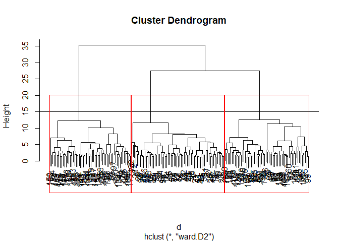
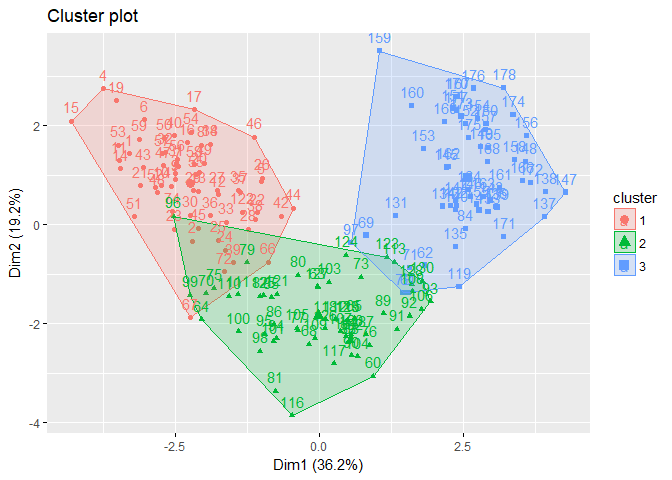

Blog Post 1 - Wine Blog
================
Derek Shambo
November 15, 2018

The analysis conducted will utilize clustering. The goal here will be to see if there is some natural segmentation in the wines. This could be utilized to help someone understand find other wines that they enjoy, or wines that they should avoid. It may also be useful in helping wine makers understand what chemical properties create certain flavor profiles.

Data input and exploration: The data being analyzed is different properties of wine. It is the results of chemical analysis conducted on the wines. All of the wines come from the same region in Italy, and from 3 different cultivars in that region.

``` r
#data load in. Col names taken from uci website
wine_data <- read_csv("https://archive.ics.uci.edu/ml/machine-learning-databases/wine/wine.data",
                      col_names = c("Col 1",
                                    "Alcohol",
                                    "Malic acid",
                                    "Ash",
                                    "Alcalinity of ash",
                                    "Magnesium",
                                    "Total phenols",
                                    "Flavanoids",
                                    "Nonflavanoid phenols",
                                    "Proanthocyanins",
                                    "Color intensity",
                                    "Hue",
                                    "OD280/OD315 of diluted wines",
                                    "Proline"))
```

    ## Parsed with column specification:
    ## cols(
    ##   `Col 1` = col_integer(),
    ##   Alcohol = col_double(),
    ##   `Malic acid` = col_double(),
    ##   Ash = col_double(),
    ##   `Alcalinity of ash` = col_double(),
    ##   Magnesium = col_integer(),
    ##   `Total phenols` = col_double(),
    ##   Flavanoids = col_double(),
    ##   `Nonflavanoid phenols` = col_double(),
    ##   Proanthocyanins = col_double(),
    ##   `Color intensity` = col_double(),
    ##   Hue = col_double(),
    ##   `OD280/OD315 of diluted wines` = col_double(),
    ##   Proline = col_integer()
    ## )

``` r
#col 1 is a class item, but there isn't documentation on what those classes actually represent, so this column will be removed
wine_data$`Col 1` <- NULL

#check for NAs
sum(is.na(wine_data)) #There are no NAs present in the data!
```

    ## [1] 0

``` r
#lets take a look at the data
summary(wine_data)
```

    ##     Alcohol        Malic acid         Ash        Alcalinity of ash
    ##  Min.   :11.03   Min.   :0.740   Min.   :1.360   Min.   :10.60    
    ##  1st Qu.:12.36   1st Qu.:1.603   1st Qu.:2.210   1st Qu.:17.20    
    ##  Median :13.05   Median :1.865   Median :2.360   Median :19.50    
    ##  Mean   :13.00   Mean   :2.336   Mean   :2.367   Mean   :19.49    
    ##  3rd Qu.:13.68   3rd Qu.:3.083   3rd Qu.:2.558   3rd Qu.:21.50    
    ##  Max.   :14.83   Max.   :5.800   Max.   :3.230   Max.   :30.00    
    ##    Magnesium      Total phenols     Flavanoids    Nonflavanoid phenols
    ##  Min.   : 70.00   Min.   :0.980   Min.   :0.340   Min.   :0.1300      
    ##  1st Qu.: 88.00   1st Qu.:1.742   1st Qu.:1.205   1st Qu.:0.2700      
    ##  Median : 98.00   Median :2.355   Median :2.135   Median :0.3400      
    ##  Mean   : 99.74   Mean   :2.295   Mean   :2.029   Mean   :0.3619      
    ##  3rd Qu.:107.00   3rd Qu.:2.800   3rd Qu.:2.875   3rd Qu.:0.4375      
    ##  Max.   :162.00   Max.   :3.880   Max.   :5.080   Max.   :0.6600      
    ##  Proanthocyanins Color intensity       Hue        
    ##  Min.   :0.410   Min.   : 1.280   Min.   :0.4800  
    ##  1st Qu.:1.250   1st Qu.: 3.220   1st Qu.:0.7825  
    ##  Median :1.555   Median : 4.690   Median :0.9650  
    ##  Mean   :1.591   Mean   : 5.058   Mean   :0.9574  
    ##  3rd Qu.:1.950   3rd Qu.: 6.200   3rd Qu.:1.1200  
    ##  Max.   :3.580   Max.   :13.000   Max.   :1.7100  
    ##  OD280/OD315 of diluted wines    Proline      
    ##  Min.   :1.270                Min.   : 278.0  
    ##  1st Qu.:1.938                1st Qu.: 500.5  
    ##  Median :2.780                Median : 673.5  
    ##  Mean   :2.612                Mean   : 746.9  
    ##  3rd Qu.:3.170                3rd Qu.: 985.0  
    ##  Max.   :4.000                Max.   :1680.0

Luckily our data didn't require a lot of preparation, and we are ready to dive into the analysis. As discussed before, we will be using cluster analysis to try to get a better understanding of what is in our wine data.

Cluster Creation: The first thing we need to do is create our clusters. For this we will scale our data. This insures that all variables are utilized equally in the cluster analysis. We will then create our clusters using hierarchical clustering. Using a dendogram, we can visualize our clusters and see how our data seperates.

``` r
#The first thing we want to do is scale the data
wine_scale <- as.matrix(scale(wine_data))

d <- dist(wine_scale, method = "euclidean") # distance matrix
fit <- hclust(d, method="ward.D2")
plot(fit) # display dendogram
#as we can see, there are 3 clusters that are evident
abline(h=15)

rect.hclust(fit, k=3, border="red")
```



``` r
#the boxes displayed show our three clusters
```

Analysis of clusters: We will now "cut" our dendogram at the specified point to get our 3 clusters. These clusters will be bound with our data, allowing us to analysis what those clusters actually say. We will then look at the mean value for each of our variables for each cluster. This will tell us what is unique about each cluster.

``` r
#first, we will cut our dendogram at 3 clusters
cut <- cutree(fit, k = 3)

#next, we will bind our data with that cut to know which wines belong wo which clusters
wine_clust <- cbind(wine_data, cut)

#this will allow us to visualize the clusters
fviz_cluster(list(data = wine_clust[-14], cluster = cut))
```



``` r
(sum_clusts <- wine_clust %>%
     group_by(cut) %>%
     summarise_all(funs(mean)))
```

    ## # A tibble: 3 x 14
    ##     cut Alcohol `Malic acid`   Ash `Alcalinity of ash` Magnesium
    ##   <int>   <dbl>        <dbl> <dbl>               <dbl>     <dbl>
    ## 1     1    13.7         1.97  2.46                17.5     106. 
    ## 2     2    12.2         1.94  2.22                20.2      92.6
    ## 3     3    13.1         3.17  2.41                21.0      99.9
    ## # ... with 8 more variables: `Total phenols` <dbl>, Flavanoids <dbl>,
    ## #   `Nonflavanoid phenols` <dbl>, Proanthocyanins <dbl>, `Color
    ## #   intensity` <dbl>, Hue <dbl>, `OD280/OD315 of diluted wines` <dbl>,
    ## #   Proline <dbl>

``` r
#we can now view sum_clusts to see what each cluster looks like, and how they compare to each other
```

Wines in Cluster 1: High alcohol content Average amount of Malic Acid High Ash Low Alcalinity of ash* High Magnesium High total phenols High Flavanoids* Low Nonflavanoi phenols High Proanthocyanins Average color intensity High hue High OD280/OD315 of diluted wines High Proline\*

Wines in Cluster 2: Low alcohol content Average Malic acid Low ash* Average alcalinity of ash Low Magnesium Average Flavanoids Average Nonflavanoid phenols Average Proanthocyanins Low color intensity* Average hue Average OD280/OD315 of diluted wines Low Proline

Wines in Cluster 3: Average alcohol content High Malic acid* High ash High alcalinity of ash Medium Magnesium Low Flavanoids* High Nonflavanoid phenols Low Proanthocyanins* High color intensity Low hue Low OD280/OD315 of diluted wines* medium-low Proline

\*significantly lower or higher than the other two clusters

Looking at our dendogram and cluster visualization, there was a pretty clear split for these three clusters.
